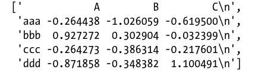

# A Getting Started with pandas
## 1. Essential Functionality 
### 1.1 Reindexing
Create a new index for dataframe or series
There are some tool for fill the data if there are new indexes. (ffil, bfill)
<br />
### 1.2 Dropping entries from an axis
<br />
### 1.3 Indexing, selection, and filtering
Use **iloc** instead of **ix** to select a particular position in dataframe
<br />
### 1.4 Arithmetic and data alignment
Do numpy in pandas wont change type of pandas.
<br />
### 1.5 Function application and mapping
Use **lambda** to make a operator would be great
<br />
### 1.6 Sorting and ranking
Syntax: sort_index(axis=?), rank
<br />
In dataframe, it can be sort by a column or row.
<br />
### 1.7 Axis indexes with duplicate values
<br />
<br />
<br />
## 2. Summarizing and Computing Descriptive Statistics
### 2.1 Correlation and Covariance
Need definition for 2 of these.
<br />
### 2.2 Unique Values, Value Counts, and Membership
Note that only **Series** has *value_count*. In dataframe, we need to use *dataframe.apply(pd.value_count)*, it will return the frequency of every different object in each column of the dataframe.
<br />
<br />
<br />
## 3. Handling Missing Data
Syntax: dropna, fillna, isnull, notnull
### 3.1 Filtering Out Missing Data
how='all' will drop rows that are all NA
what is thresh?
<br />
### 3.2 Filling in Missing Data
inplace=True is make a new one with changes
<br />
<br />
<br />
## 4. Hierarchical Indexing
Hierarchical indexing is an important feature of pandas enabling you to have multiple index levels on an axis.
Example:
```
data = Series(np.random.randn(10),
.....:		index=[['a', 'a', 'a', 'b', 'b', 'b', 'c', 'c', 'd', 'd'],
.....:			[1, 2, 3, 1, 2, 3, 1, 2, 2, 3]])

```
*This data can be changed to be dataframe by unstack()*
<br />
There are many example of complex hierarchical index data.
Dataframe can be represented like this:
```
frame = DataFrame(np.arange(12).reshape((4, 3)),
 			index=[['a', 'a', 'b', 'b'], [1, 2, 1, 2]],
 			columns=[['Ohio', 'Ohio', 'Colorado'],
 				['Green', 'Red', 'Green']])
```

### 4.1 Reordering and Sorting Levels
When **sort** data that has hierarchical indexes, we need to notice the level. Sort which level?
<br />
### 4.2 Summary Statistics by Level
Do operation by levels
<br />
### 4.3 Using a DataFrame’s Columns
You can use columns of dataframe to be index. Syntax: set_index() default is drop the columns that are used to be indexes
<br />
<br />
<br />
<br />
<br />
# B Data Loading, Storage, and File Formats
<br />
## 1. Reading and Writing Data in Text Format
There are many data follow up these:
1. *Indexing*: this data is not defined names. So the the names of columns can be in the columns of data
2. *Type inference and data conversion*: this data you dont have any information of columns' type 
3. *Datetime parsing*: includes combining capability, including combining date and time information spread over multiple columns into single column
4. *Iterating*:
5. *Unclean data issues*: skipping rows or a footer, comments, or other minor things like numeric data with thousands separated by commas
<br />
**Technique**

To duel with this data, we use *pd.read_table('',sep='\s+')*
<br />
### 1.2 Writing Data Out to Text Format
Syntax: to_csv()
<br />
### 1.3 Manually Working with Delimited Formats
Read each line of file and do split
<br />
### 1.4 JSON Data
This data is usually in HTTP request, Because its flexible.
```
obj = """
	{"name": "Wes",
	"places_lived": ["United States", "Spain", "Germany"],
	"pet": null,
	"siblings": [{"name": "Scott", "age": 25, "pet": "Zuko"},
		     {"name": "Katie", "age": 33, "pet": "Cisco"}]
}
"""
```
Syntax: to_json() and from_json()
<br />
### 1.5 XML and HTML: Web Scraping
<br />
<br />
<br />
## 2. Binary Data Formats
This an easy one which we need to store data but the problem is unstable. **pickle** is only recommend to be a short-term storage format.
<br />
### 2.1 Using HDF5 Format
HDF5 and PyTables
Encourage to use these
<br />
*Benefit:* speed, more efficent because its organization
*Note:* HDF5 is not a database. It is best suitable for write-one
<br />
### 2.2 Reading Microsoft Excel Files
Syntax: 
```
pd.ExcelFile('data.xls')
table = xls_file.parse('Sheet1')
``` 
<br />
<br />
<br />
## 3 Interacting with HTML and Web APIs
<br />
<br />
<br />
## 4 Interacting with Databases
**Lib:** sqlite3


